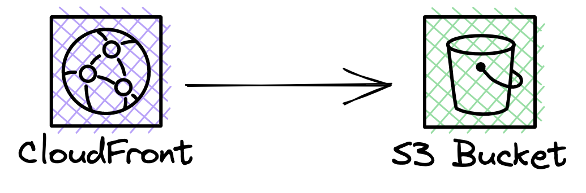

# CDK Construct for deploying a website

Deploying a "static" website on AWS is surprisingly tricky - it requires managing S3, CloudFront, the security between
them, Route 53, and more.
This CDK construct provides a higher level CDK abstraction over all of these services to make life a little easier.

This construct can't support every use case - if it doesn't work for you feel free to grab the source and make your own
version, or [let me know](mailto:mike@symphonia.io) if you have a suggestion for how it can be extended!

<!-- TOC -->
* [CDK Construct for deploying a website](#cdk-construct-for-deploying-a-website)
  * [What it deploys](#what-it-deploys)
  * [Using cdk-website](#using-cdk-website)
    * [Getting started](#getting-started)
    * [Deploying content](#deploying-content)
    * [Setting a custom domain name](#setting-a-custom-domain-name)
      * [Setting a single custom domain name](#setting-a-single-custom-domain-name)
      * [Setting multiple custom domain names](#setting-multiple-custom-domain-names)
    * [Specifying a CloudFront Function for pre-processing requests](#specifying-a-cloudfront-function-for-pre-processing-requests)
    * [Setting additional behavior options](#setting-additional-behavior-options)
  * [TODO](#todo)
<!-- TOC -->

## What it deploys



This construct deploys the following primary resources:

* An S3 bucket, with a few configuration options to make it more secure than default
* A CloudFront distribution, using the S3 bucket as the "origin".
    * The AWS provided CloudFront construct sets up
      an ["Origin Access Identity"](https://docs.aws.amazon.com/AmazonCloudFront/latest/DeveloperGuide/private-content-restricting-access-to-s3.html)
      to allow access to the bucket from CloudFront
    * Mostly the construct uses the defaults in the
      AWS [`Distribution` construct](https://docs.aws.amazon.com/cdk/api/v2/docs/aws-cdk-lib.aws_cloudfront.Distribution.html)
      , apart from:
      * It always redirects `http` requests to `https`
      * It sets http version to "2 and 3", enabling http3 support
    * Any `DistributionProps` property can be overridden by setting the optional `distributionPropertyOverrides` on `WebsiteProps`
* If custom domain properties are set in the configuration, then the construct sets a domain name and certificate on the
  distribution
    * It will also create a Route53 DNS record if a Route53 Zone is specified
* If a local content path is specified, then content will be uploaded to the S3 bucket during deployment


For more details, see [the source](src/index.ts).

## Using cdk-website

This README assumes that you are already very familiar with deploying to AWS using CDK. 

If you need help getting started with CDK in general, then I recommend my [CDK bare-bones app](https://github.com/symphoniacloud/cdk-bare-bones).

### Examples

* the [one included in this repo](/examples/typescript/basic)
* [Coffee Store Web Basic](https://github.com/symphoniacloud/coffee-store-web-basic) - A similar example as a template project
* [Coffee Store Web Full](https://github.com/symphoniacloud/coffee-store-web-full) - An extension of _Coffee Store Web Basic_ that is a real working demo of a production-ready website project, including TLS certificates, DNS hosting, Github Actions Workflows, multiple CDK environments (prod vs test vs dev)

### Getting started

To get started:

1. Add this cdk-website library to your project dependencies
2. In your application stack instantiate the construct, e.g. in TypeScript:

```typescript
new Website(this, 'website')
```

3. Deploy as usual

### Deploying content

If you set the optional `content` property then the construct will configure
a [`BucketDeployment` resource](https://docs.aws.amazon.com/cdk/api/v2/docs/aws-cdk-lib.aws_s3_deployment-readme.html)
that will
upload files from a local path to your website's S3 bucket.

e.g. the following configuration will upload everything from the local `public` directory to your website:

```typescript
new Website(this, 'website', {
    content: { path: 'public' }
})
```

To specify that an
[_invalidation_](https://docs.aws.amazon.com/AmazonCloudFront/latest/DeveloperGuide/Invalidation.html) should be created
during deployment to force a refresh of cached content, set
the `performCacheInvalidation` on `content` to true.
Note that
[invalidations are not free](https://docs.aws.amazon.com/AmazonCloudFront/latest/DeveloperGuide/Invalidation.html#PayingForInvalidation)
once you reach a certain number per month. For dev / test environments you may wish to disable caching (see further down on how to do this.)

### Setting a custom domain name

In production and testing you will likely want to use a custom domain name, rather than the CloudFront-provided URL.

To do this you will first need to have created a certificate in AWS Certificate Manager **in the us-east-1 region** -
see
[here](https://docs.aws.amazon.com/cdk/api/v2/docs/aws-cdk-lib.aws_cloudfront-readme.html#domain-names-and-certificates)
for more details

#### Setting a single custom domain name

To set a single custom domain name, add or update the custom domain property:

```typescript
new Website(this, 'website', {
    customDomain: {
        domainName: 'mywebsite.example.com',
        certificate: {
            fromArn: myCertificateArn
        }
    }
})
```

... where `myCertificateArn` is the ARN of your certificate.

Alternatively you can just set `certificate` to be the actual CDK `ICertificate` object - this might be useful if you
manage the certificate in the same stack as your website.

Setting `domainName` and `certificate` will update CloudFront to use your custom domain name, but these two properties
alone aren't sufficient to register the CloudFront distribution in DNS. To do that you have two options:

Firstly, you can manage DNS yourself (again,
see [here](https://docs.aws.amazon.com/cdk/api/v2/docs/aws-cdk-lib.aws_cloudfront-readme.html#domain-names-and-certificates).)

OR, if you manage DNS through Route53 in the same account as your website, then you can set the `hostedZone` property
on `customDomain`, e.g.:

```typescript
new Website(this, 'website', {
    customDomain: {
        domainName: 'mywebsite.example.com',
        certificate: {
            fromArn: myCertificateArn
        },
        hostedZone: {
            fromDomainName: `example.com`
        }
    }
})
```

**NB:** `fromDomainName` should be the domain name of the **hosted zone**, **not** the website.

Similarly to the `certificate` property - if you already have the CDK object representing the Hosted Zone in your CDK
app then you can just set `hostedZone` to be that object.

#### Setting multiple custom domain names

A CloudFront distribution can have multiple domain names, but they must share a certificate.

For example, you might want to use `www.mywebsite.example.com` **and** `mywebsite.example.com` on the same distribution.
These would share a certificate that could support both names.

On the other hand each separate domain name might be resolved in a different hosted zone, and so the configuration
for the `cdk-website` construct reflects that.

Here's an example:

```typescript
new Website(this, 'website', {
    customDomain: {
        certificate: {
            fromArn: myCertificateArn
        },
        domains: [{
            domainName: 'mywebsite.example.com',
            hostedZone: {
                fromDomainName: `mywebsite.example.com`
            }
        }, {
            domainName: 'www.mywebsite.example.com',
            hostedZone: {
                fromDomainName: `mywebsite.example.com`
            }
        }]
    }
})
```

In this example both `www.mywebsite.example.com` **and** `mywebsite.example.com` share a hosted zone.

Note that just like with a single custom domain, the `hostedZone` property on each domain is optional - if you don't set it it's assumed that you'll manage DNS yourself.

### Specifying a CloudFront Function for pre-processing requests

Since CloudFront doesn't support things like [htaccess files](https://httpd.apache.org/docs/2.4/howto/htaccess.html),
it's useful
to be able pre-process all requests
using [CloudFront Functions](https://aws.amazon.com/blogs/aws/introducing-cloudfront-functions-run-your-code-at-the-edge-with-low-latency-at-any-scale/)
, e.g. to redirect default paths in subdirectories.

To specify the source code of a CloudFront Function, add the following to the construct properties:

```typescript
new Website(this, 'website', {
    preProcessFunctionCode: { fromPath: 'src/cloudfront/preProcessFunction.js' },
})
```

This will automatically add a `VIEWER_REQUEST` CloudFront function to your distribution, using the code at the specified
path.

If you want to bundle your own zip file then you can also set `preProcessFunctionCode` to any valid
[`FunctionCode` object](https://docs.aws.amazon.com/cdk/api/v2/docs/aws-cdk-lib.aws_cloudfront.FunctionCode.html).

The [Coffee Store Web Full](https://github.com/symphoniacloud/coffee-store-web-full) has an example of using a CloudFront function.

### Setting additional behavior options

The CloudFront distribution will use the default
[`BehaviorOptions` from the underlying CDK library](https://docs.aws.amazon.com/cdk/api/v2/docs/aws-cdk-lib.aws_cloudfront.BehaviorOptions.html)
by default (apart
from setting `http` requests to redirect to `https`) . You may want to change some of these, which you can do by setting
the optional `additionalDefaultBehaviorOptions` field on the construct properties.

This field is named this because it overrides the so-called "default behavior" settings in the distribution.

If you set `additionalDefaultBehaviorOptions` then it must be a valid
[`AddBehaviorOptions` object](https://docs.aws.amazon.com/cdk/api/v2/docs/aws-cdk-lib.aws_cloudfront.AddBehaviorOptions.html)
.

For example, by default CDK will create a distribution that uses the
[_CachingOptimized_ cache policy](https://docs.aws.amazon.com/AmazonCloudFront/latest/DeveloperGuide/using-managed-cache-policies.html).
In test situations especially this might not be the best choice - instead you may want to use the _CachingDisabled_
policy.

To do this with `cdk-website`, you would do the following:

```typescript
new Website(this, 'website', {
    additionalDefaultBehaviorOptions: {
        cachePolicy: CachePolicy.CACHING_DISABLED
    }
})
```

## TODO

* publish for other languages (currently just JavaScript / TypeScript to NPM)
